# Apache Kafka: Core Concepts & Architecture
This guide offers a complete, visual, and practical walkthrough of Apache Kafka. 

We'll cover core components like brokers topics, and partitions, the lifecycle of a record, and interactions with the broader Confluent ecosystem.

> Kafka is a distributed event streaming platform built for high-throughput, low-latency, and horizontally scalable real-time data pipelines.


# Core Components
- Producers: Client applications that publish (write) events to Kafka topics.
- Consumers: Client applications that subscribe to (read and process) these events.
- Topics: A named stream of records. Topics are split into partitions.
- Partitions: The basic unit of parallelism in Kafka. A topic can have one or more partitions.
- Brokers: Kafka servers that form the cluster. Each broker stores data and serves client requests.
- Consumer Groups: A group of consumers that work together to consume a topic. Each partition is consumed by exactly one consumer within the group.
- Kafka stores records in an append-only commit log, where each record in a partition is assigned a sequential ID called an offset.

# Visualizing the Flow
Diagrams are the best way to understand how Kafka's components interact.

High-Level Architecture: Producers, Topics, and Consumers
This diagram shows the relationship between a producer, a topic with multiple partitions, and a consumer group that reads from it.

```mermaid
graph TD
    Producer(["📤 Producer"])

    subgraph "📦 Apache Kafka Cluster"
        Topic["🔹 Topic: User Signups"]
        subgraph " "
            P1["Partition 0"]
            P2["Partition 1"]
            P3["Partition 2"]
        end
        Topic --- P1 & P2 & P3
    end

    subgraph "👥 Consumer Group (Notification Service)"
        C1["Consumer A"]
        C2["Consumer B"]
    end

    Producer -- "sends records" --> Topic
    P1 -- "read by" --> C1
    P2 -- "read by" --> C2
    P3 -- "read by" --> C1

    style Producer fill:#D4EDDA,stroke:#155724,stroke-width:2px
    style C1 fill:#D1ECF1,stroke:#0C5460,stroke-width:2px
    style C2 fill:#D1ECF1,stroke:#0C5460,stroke-width:2px
    style Topic fill:#FFF3CD,stroke:#856404,stroke-width:2px

```



# Explanation:

1. A Producer sends records to the User Signups topic.
1. The topic is divided into three Partitions, allowing the data stream to be split.
1. A Consumer Group subscribes to the topic. Kafka distributes the partitions among the available consumers in the group.
1. Consumer A handles Partition 0 and Partition 3, while Consumer B handles Partition 2. This is how Kafka achieves parallel processing.
1. Record Flow: The Commit Log and Offsets

This diagram shows how records are stored in a single partition and how different consumer groups can read the data independently.

```mermaid
graph LR
    Producer(["📤 Producer"])

    subgraph "🧱 Broker: Commit Log for Partition 0"
        direction LR
        R0["Record<br/>Offset 0"] --> R1["Record<br/>Offset 1"] --> R2["Record<br/>Offset 2"] --> R3["Record<br/>Offset 3"]
    end

    subgraph "👥 Consumer Group A (Real-time Dashboard)"
        direction TB
        C1(["Consumer 1"])
        OffsetA[("Committed<br/>Offset: 2")]
        C1 -- reads & processes --> R2
    end

    subgraph "👥 Consumer Group B (Archiving to S3)"
        direction TB
        C2(["Consumer 2"])
        OffsetB[("Committed<br/>Offset: 0")]
        C2 -- reads & processes --> R0
    end

    Producer -- "writes record" --> R0

    linkStyle 0 stroke-width:2px,fill:none,stroke:green;
    linkStyle 3 stroke-width:2px,fill:none,stroke:#0C5460;
    linkStyle 5 stroke-width:2px,fill:none,stroke:#721C24;

    style R0,R1,R2,R3 fill:#E2E3E5,stroke:#383D41,stroke-width:2px
    style C1 fill:#D1ECF1,stroke:#0C5460,stroke-width:2px
    style C2 fill:#F8D7DA,stroke:#721C24,stroke-width:2px
    style Producer fill:#D4EDDA,stroke:#155724,stroke-width:2px
```

# Explanation:
1. The Producer appends records to the partition log. Each record gets a new, sequential Offset.
1. The log is immutable—records cannot be changed or deleted.
1. Consumer Group A has read up to Offset 2. Its progress is tracked independently.
1. Consumer Group B, a completely separate service, is also reading from the same partition but is at Offset 0.

This demonstrates how offsets decouple consumers, allowing multiple applications to consume the same data at their own pace.

# The Confluent Ecosystem: Kafka Extended
The Confluent Platform enhances open-source Kafka with tools designed for enterprise-grade streaming.

1. Kafka Connect: A framework for connecting Kafka with external systems like databases, key-value stores, and cloud services. It uses Sources to ingest data and Sinks to export data.

1. Schema Registry: Provides centralized schema management (Avro, Protobuf, JSON Schema) and enforces compatibility rules to prevent producers from breaking downstream consumers.

1. ksqlDB: A streaming SQL engine that allows you to build real-time applications directly on top of Kafka topics by using familiar SQL syntax to filter, transform, join, and aggregate data.

1. Control Center: A web-based UI for managing and monitoring the Confluent Platform, offering visibility into brokers, topics, consumer lag, and more.

1. End-to-End Ecosystem Flow
This diagram illustrates how these components work together in a real-world data pipeline.

```mermaid
graph TD
    subgraph "External Systems"
        direction LR
        DB[(🗄️ Source DB)]
        DataWarehouse[(🏢 Sink DW)]
    end

    subgraph "Confluent Platform"
        direction LR

        subgraph "Data Integration"
            ConnectSource["🔌 Connect Source"]
            ConnectSink["🔌 Connect Sink"]
        end

        KAFKA[("🔹 Kafka<br/>Topics")]

        subgraph "Stream Processing & Governance"
            KSQL[("🚀 ksqlDB")]
            SR[("📜 Schema Registry")]
            CC[("🖥️ Control Center")]
        end
    end

    DB -- "Raw Data" --> ConnectSource
    ConnectSource -- "writes with schema" --> KAFKA
    ConnectSource -- "validates against" --> SR

    KAFKA -- "reads raw topic" --> KSQL
    KSQL -- "writes processed topic" --> KAFKA

    KAFKA -- "sends processed data" --> ConnectSink
    ConnectSink -- "loads data" --> DataWarehouse

    CC -- "Monitors & Manages All" --> KAFKA
    CC --- ConnectSource
    CC --- ConnectSink
    CC --- KSQL

    style KAFKA fill:#FFF3CD,stroke:#856404,stroke-width:2px
    style KSQL fill:#D1ECF1,stroke:#0C5460,stroke-width:2px
    style SR fill:#E2E3E5,stroke:#383D41,stroke-width:2px
    style CC fill:#D4EDDA,stroke:#155724,stroke-width:2px
```



# Explanation of the Flow:

1. Ingestion: A Kafka Connect Source pulls data from an external Source DB (like PostgreSQL).
1. Schema Enforcement: As records are ingested, Connect consults the Schema Registry to validate their structure, preventing data quality issues. The records are then written to a Kafka topic.
1. Real-time Processing: ksqlDB reads from the raw data topic, performs transformations or aggregations (e.g., calculating a running sales total), and writes the results to a new, processed topic in Kafka.
1. Data Export: A Kafka Connect Sink reads from the processed topic and loads the data into an external system, like a Sink DW (Data Warehouse) for analysis.
1. Monitoring: The Control Center provides a unified view to monitor the health, throughput, and status of all components in the pipeline.

# Key Takeaways

* Offset: The unique ID for a record within a partition. It's the key to consumer state and data replay.
* Consumer Group: The mechanism for scalable and fault-tolerant consumption.
* Replication: Kafka copies each partition across multiple brokers to ensure data durability.
* Leader Election: For each partition, one broker acts as the "leader" to handle all reads and writes. If it fails, another replica is elected as the new leader.